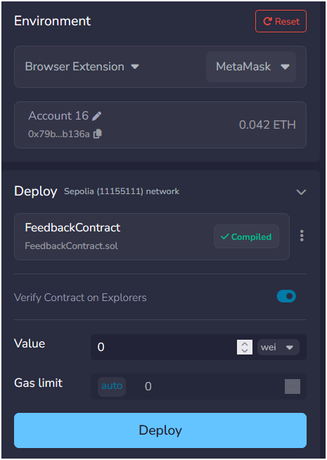
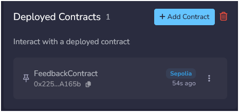

# Feedback Management DApp: Decentralized Feedback System

A blockchain-based feedback management system built on Ethereum (Sepolia Testnet).
Students submit anonymous feedback; admins respond and update status - all recorded immutably on-chain.

---

## Tech Stack

| Layer | Technology |
|-------|-----------|
| Smart Contract | Solidity |
| Blockchain | Ethereum Sepolia Testnet |
| Frontend | Vanilla JS, Bootstrap 5, Lucide Icons |
| Backend | Node.js, Express.js |
| Web3 | Ethers.js v6, MetaMask |

```

## Project Structure

feedback-management-dapp/
│
├── contracts/
│ └── FeedbackContract.sol # Main smart contract
│
├── frontend/
│ ├── index.html
│ ├── css/
│ │ └── style.css
│ └── js/
│ ├── config.js # Contract address + ABI
│ ├── wallet.js # MetaMask connect/disconnect, toast
│ ├── api.js # All backend API calls
│ ├── pages.js # Page renderers (dashboard, view, admin)
│ └── app.js # Event handlers and actions
│
├── backend/
│ ├── server.js # Express entry point
│ ├── config/
│ │ ├── blockchain.js
│ │ └── contractABI.json
│ ├── controllers/
│ │ └── feedbackController.js
│ ├── middleware/
│ │ ├── authMiddleware.js
│ │ ├── errorHandler.js
│ │ └── rateLimiter.js
│ ├── routes/
│ │ └── feedbackRoutes.js
│ ├── services/
│ │ └── blockchainService.js
│ ├── eslint.config.mjs
│ └── package.json
│
└── README.md

```

## Smart Contract Features

- Submit feedback with category (Teaching, Facilities, Admin, Other)
- Edit feedback (owner only, PENDING status only)
- Upvote / Downvote (one vote per wallet, cannot vote own feedback)
- Admin respond on-chain
- Update status: PENDING → REVIEWED → RESOLVED
- Full edit history stored on-chain
- All responses stored on-chain

---

## Getting Started

### Prerequisites

- Node.js v18+
- MetaMask browser extension
- Sepolia testnet ETH ([faucet](https://sepoliafaucet.com))

---

### 1. Clone the Repository

```bash
git clone https://github.com/kirankumarrokaya/feedback-management-dapp.git
cd feedback-management-dapp
```

### 2. Install Dependencies

```bash
# Backend
cd backend
npm install
```

### 3. Configure Environment Variables

Create a `.env` file in the backend directories:

**Backend `.env`** (for Backend deployment):
```env
PORT=5000
ADMIN_WALLET_ADDRESS=<admin_wallet_address>
CONTRACT_ADDRESS=<contract_address>
ALCHEMY_URL=https://eth-sepolia.g.alchemy.com/v2/<API_KEY>
PRIVATE_KEY:<eth_private_key>

```


### 4. Compile and Deploy Smart Contract

```bash
https://remix.ethereum.org
```

- In remix IDE, first remove other contract if there
- Then paste the contracts/FeedbackContract.sol file from this codebase to contract folder in Remix IDE
- Now click Compile button
- After Compile is successful, click `Debug and Run Transactions` button from the sidebar
- Inside this select `Browser Estension` and then `Metamask` in environment and click `Deploy`
 
- Now it will Ask to connect the metamask , after confirmation we will get `Deployed Contract Address`

- Copy contract address and paste in `CONTRACT_ADDRESS` of `.env` file of backend
- And Click on `Solidity Compiler` from sidebar and at the bottom click on `ABI` which will copy ABI json data and paste this in `backend/config/contractABI.json` file

### Now copy metamask private key and Admin Wallet from
- Acconut 1 -> three dots(.) -> Account Details -> Private Keys -> enter password and then copy `eth private key`
*DO NOT SHARE THIS KEY TO ANYONE ELSE*
- Now Paster this key in .env file `PRIVATE_KEY` variable

- Now For admin Wallet, just copy eth wallet address and paste in `ADMIN_WALLET_ADDRESS` varaible

### Now for `ALCHEMY_URL` 
- Signin to to https://login.alchemy.com/u/signup
- Then Create New App 
- Give name
- In Chain Select `Ethereum`
- And choose any one and go to next step for other things
- After App Created Copy `Api key` and paste in `ALCHEMY_URL` in `<API_KEY>`

Copy the deployed contract address into:
- `frontend/js/config.js` → `CONTRACT_ADDRESS`
- `backend/.env` → `CONTRACT_ADDRESS`

### 5. Start the Backend

```bash
cd backend
node server.js
# Running on http://localhost:5000
```

### 6. Open the Frontend

Open `frontend/index.html` directly in your browser or as `Live Server`

*I perfer Live Server*

```Now App is ready to use```

---

## API Endpoints

| Method | Endpoint | Description |
|--------|----------|-------------|
| `POST` | `/api/feedback` | Submit new feedback |
| `GET` | `/api/feedback` | Get all feedback |
| `GET` | `/api/feedback/stats` | Get dashboard stats |
| `GET` | `/api/feedback/:id` | Get single feedback |
| `PUT` | `/api/feedback/:id/edit` | Edit feedback text |
| `PUT` | `/api/feedback/:id/status` | Update feedback status |
| `POST` | `/api/feedback/:id/respond` | Admin respond |
| `POST` | `/api/feedback/:id/comment` | Student comment |
| `GET` | `/api/feedback/:id/responses` | Get all responses |
| `GET` | `/api/feedback/:id/history` | Get edit history |
| `GET` | `/api/feedback/:id/vote-check` | Check if wallet voted |
| `GET` | `/api/auth/check-admin` | Check admin role |

---

## How Voting Works

Votes are submitted **directly from the user's MetaMask wallet** to the smart contract - not through the backend. This ensures the contract records the correct voter address and prevents vote spoofing.

```

User clicks Upvote
↓
MetaMask signs transaction
↓
contract.upvoteFeedback(id) called on-chain
↓
Receipt returned → txHash shown in modal
```


## Roles

| Role | Capabilities |
|------|-------------|
| **Student** | Submit, edit own pending feedback, upvote/downvote, comment |
| **Admin** | All student actions + respond officially, update status |

Admin wallets are defined in `backend/.env` under `ADMIN_WALLETS`.

---

## Environment Variables Reference

| Variable | Where | Description |
|----------|-------|-------------|
| `PRIVATE_KEY` | Root `.env` | Deployer wallet private key |
| `ALCHEMY_URL` | Root + Backend `.env` | Alchemy Sepolia RPC |
| `ADMIN_WALLET_ADDRESS` | Backend `.env` | Comma-separated admin wallet addresses |
| `CONTRACT_ADDRESS` | Backend `.env` + `config.js` | Deployed contract address |
| `PORT` | Backend `.env` | Backend server port (default 5000) |

---

## Security Notes

- Never commit `.env` files - add them to `.gitignore`
- Never expose your `PRIVATE_KEY` publicly
- Admin role is verified server-side by wallet address
- Voting is verified on-chain - cannot be faked via API

---

## License

MIT - free to use and modify.